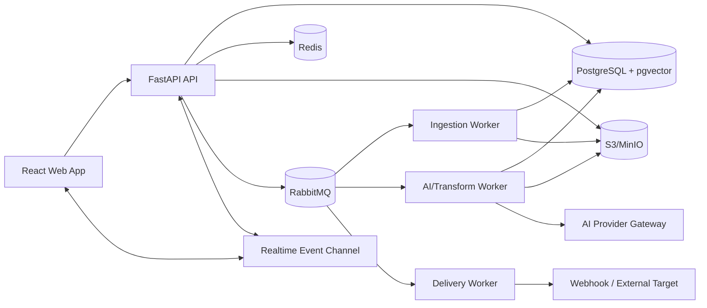
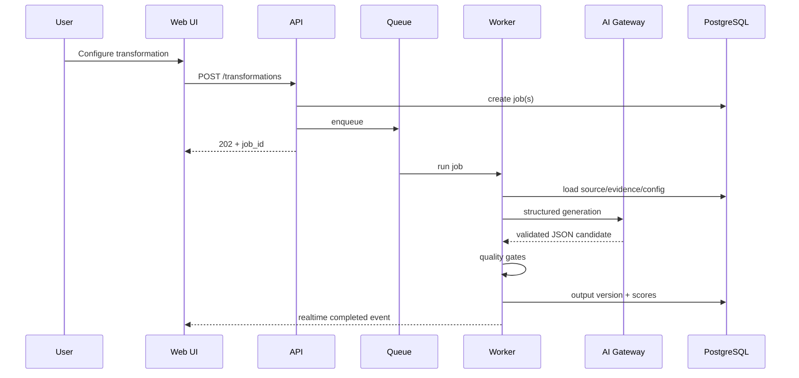

# System Architecture

[Index](./00_INDEX.md) · [Previous](./03_ROLES_AND_USER_FLOWS.md) · [Next](./05_REPOSITORY_AND_SERVICE_BOUNDARIES.md)

---

## Architectural style

Use a **modular monolith + background workers** for P0. The logical five-layer architecture remains explicit through package boundaries and interfaces.

## Five logical layers

1. **Input Ingestion** — adapters, validation, normalization, chunking, staging.
2. **Analysis & Understanding** — language, entities, topics, claims, embeddings, multimodal metadata.
3. **Transformation Core** — orchestration, prompt management, model calls, format-specific transformers.
4. **Output Generation** — validation, brand application, rendering, packaging, delivery.
5. **Configuration & Management** — auth/RBAC, templates, brand profiles, integrations, audit, feedback, usage.

## Runtime components

## Request flow

### Upload
1. UI requests source creation.
2. API authorizes workspace.
3. API stores metadata.
4. File goes to object storage, preferably presigned upload for large files.
5. API enqueues ingestion job.
6. Worker processes and emits progress events.

### Transform
1. UI submits `TransformationRequest`.
2. API validates source readiness + config.
3. API creates batch/job records.
4. Worker builds context package.
5. Transformer requests structured output via AI gateway.
6. Validator checks schema + quality.
7. Output version persists.
8. Event notifies UI.

## Data flow boundary

Source content is **data**, never control instructions.

All model calls must separate:
- immutable system policy,
- developer/template instruction,
- structured transformation configuration,
- explicitly delimited source content.

## Dependency direction

`api → application → domain ← infrastructure`

Domain interfaces must not import provider SDKs.

Examples:
- `LLMProvider` interface lives in application/domain boundary.
- `AnthropicProvider` and `OpenAIProvider` live in infrastructure.
- `VectorStore` interface does not expose pgvector-specific types.

## Transaction boundary

Use DB transactions for:
- source metadata creation,
- job creation,
- output version creation,
- review status changes,
- webhook attempt state transitions.

External API calls happen outside long-held DB transactions.

## Consistency model

- Metadata: strong consistency in PostgreSQL.
- Job progress: eventual consistency via events + DB status.
- Object storage: referenced by immutable object key/version.
- Output versioning: append-only.

## Multi-tenancy

P0 is workspace-scoped logical multi-tenancy.
Every business table contains `workspace_id` directly or through a protected parent.
Every repository query must apply workspace authorization.

## Scaling path

Scale independently by adding:
- API replicas,
- ingestion workers,
- transform workers,
- delivery workers.

Future extraction candidates:
- ingestion service,
- AI gateway,
- delivery/integrations service,
- analytics service.

## High-level sequence

## Technology alignment

The proposal’s FastAPI, React/TypeScript, PostgreSQL, Redis, RabbitMQ/Kafka, S3/GCS, Kubernetes/Helm, GitHub Actions, Prometheus/Grafana, and AI model choices are retained conceptually. P0 reduces infrastructure where doing so lowers single-developer operational cost.
