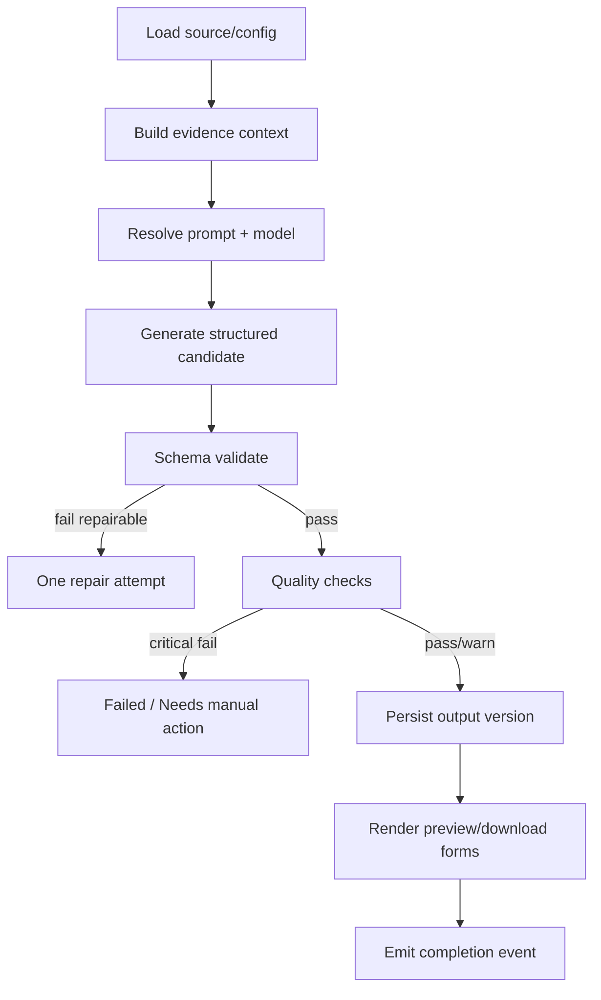

# Transformation Orchestrator

[Index](./00_INDEX.md) · [Previous](./10_AI_MODEL_GATEWAY.md) · [Next](./12_TRANSFORMER_OUTPUT_SCHEMAS.md)

---


## Responsibilities

The orchestrator:
- validates source readiness,
- validates transformation configuration,
- selects transformer,
- builds context/evidence package,
- selects prompt version,
- calls AI gateway,
- runs quality gates,
- creates output/version,
- emits progress and audit events.

It does not contain format-specific prompt text.

## Base transformer protocol

```text
supports(transform_type) -> bool
build_input(source_context, config, brand) -> TransformerInput
generate(transformer_input, prompt_version) -> Candidate
validate(candidate, context) -> QualityReport
render(candidate) -> RenderedOutput
```

## Job graph



## Transformation configuration

Canonical fields:
- `audience`,
- `tone`,
- `language`,
- `detail_level`,
- `objective`,
- `content_style`,
- `brand_profile_id`,
- `length_target`,
- `fact_strictness`,
- `citation_mode`,
- `call_to_action`,
- `platform_options`,
- `custom_instruction` with bounded length.

## Configuration precedence

1. system safety policy,
2. workspace mandatory rules,
3. transformer defaults,
4. brand profile,
5. user configuration,
6. bounded custom instruction.

Lower levels cannot override safety or access rules.

## Multi-format batch

A single batch can request multiple target formats.

Shared stages:
- source analysis,
- context base,
- brand loading.

Independent stages:
- prompt selection,
- generation,
- format validation,
- output persistence.

One failed target must not fail successful sibling targets.

## Regeneration

### Full regeneration
- load base version for comparison,
- allow config override,
- create new AI-origin version.

### Section regeneration
- resolve JSON path/section ID,
- build local context including surrounding sections,
- instruct model to return only replacement section schema,
- merge into new complete output version,
- rerun relevant quality checks.

## Evidence strategy

Transformers receive evidence IDs and source excerpts.
Generated factual blocks may include internal `evidence_ids` that are removed or retained depending on renderer/citation mode.

## Quality gate thresholds

Use transformer-specific thresholds.
Critical blockers include:
- invalid schema,
- platform hard limit breach,
- unsupported high-confidence factual claim under strict mode,
- detected secret/PII leak when redaction policy enabled,
- unsafe source instruction followed by output.

Warnings include:
- style deviation,
- readability variance,
- non-critical brand preference miss.

## Persistence rule

Persist raw provider response only if allowed by security policy; default to storing parsed candidate + minimal provider metadata.

## Orchestrator idempotency

Transformation creation uses a client idempotency key.
Worker stage execution additionally uses job-stage locks so retries do not create duplicate versions.
